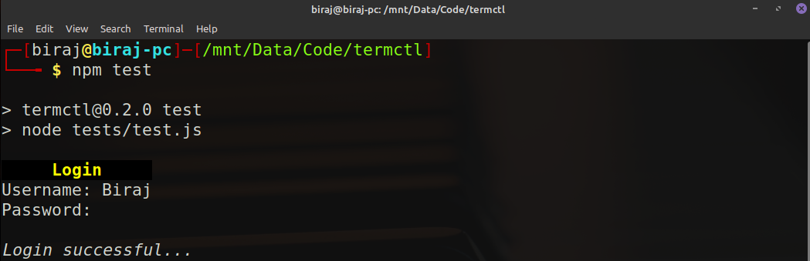

# Termctl
A simple library to do some basic terminal stuff.



# Usage
```javascript
const termctl = require("termctl");
```

**Note:** I have tested this just on my Linux Mint so I don't know if changing colors will work on Windows or Mac.

# Methods

## Input/Output

[1]: <https://nodejs.org/api/readline.html#readline_class_interface>
[2]: <https://nodejs.org/api/readline.html#readline_rl_close>

- You need to call `init()` method once before using `gets()` because **termctl** uses Node.js's **readline** module, so `init()` will be used to create an instance of [`readline.Interface`][1].

  ```javascript
  termctl.init();
  ```

- `gets()` is used to take user input from the terminal (stdin). First argument is the prompt message to be displayed. Second argument specifies whether to print what user is typing (echo). It's default value is `true`.

  ```javascript
  // termctl.gets(query?: string, echo?: boolean) => Promise<any>

  const uname = await termctl.gets("Enter your name: ");
  const pswd = await termctl.gets("Enter password: ", false);
  ```

- Call `close()` to [close][2] the [`readline.Interface`][1] instance.

  ```javascript
  termctl.close();
  ```

## Styling
Just using escape sequences inside these methods for changing styles.

- Set background color
  ```javascript
  // termctl.color.set_bg(r: number, g: number, b: number): void

  termctl.color.set_bg(255, 255, 100);
  ```

- Reset background color to default
  ```javascript
  // termctl.color.reset_bg(): void

  termctl.color.reset_bg();
  ```

- Set foreground color
  ```javascript
  // termctl.color.set_bg(r: number, g: number, b: number): void

  termctl.color.set_fg(0, 0, 0);
  ```

- Reset foreground color to default
  ```javascript
  // termctl.color.reset_bg(): void

  termctl.color.reset_fg();
  ```

- Bold
  ```javascript
  // termctl.set_bold(bold?: boolean): void

  termctl.color.set_bold();
  ```

- Italic
  ```javascript
  // termctl.set_italic(italic?: boolean): void

  termctl.color.set_italic();
  ```

- Underline
  ```javascript
  // termctl.set_underline(underline?: boolean): void

  termctl.color.set_underline();
  ```

- Reset all styles to default
  ```javascript
  // termctl.color.reset_styles(): void

  termctl.color.reset_styles();
  ```

> Read _tests/test.js_ to see termctl in action.